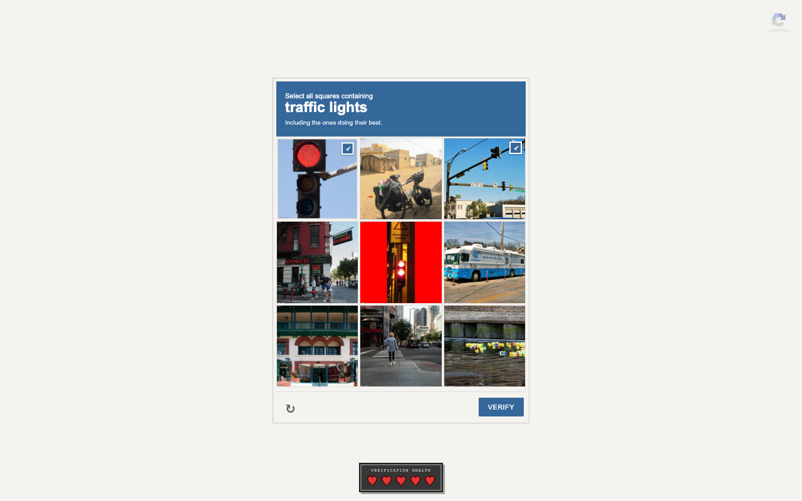

# Are You a Robot?

A fake CAPTCHA that turns boring identity verification into a strange, handmade browser game about proving you are probably not a machine.

[](https://are-you-a-robot-six.vercel.app)



## Try It

**Play here:** https://are-you-a-robot-six.vercel.app

Open the page, check the box, and survive the verification process with five hearts. No sign-up, no backend, no real identity verification.

## What It Is

Are You a Robot? starts as a plain reCAPTCHA-style widget and gradually becomes a suspicious bureaucracy of mini-games. The joke is not that the page looks wild. The joke is that it keeps looking official while the tasks become less reasonable.

## Features

- 31 handcrafted verification levels with different interaction models
- reCAPTCHA-style image grids, memory tests, timing traps, parking puzzles, canvas drawing, pointer challenges, hidden UI, and a tiny Flappy-style compliance flight
- Mobile controls for keyboard-heavy levels, plus responsive grid, canvas, and parking-lot sizing
- A five-heart health system with non-punitive logic puzzles where guessing should not cost lives
- Full-page flashlight challenge with a wall texture and cursor-controlled light cone
- LocalStorage save/resume with no backend
- A copyable final certificate that looks more official than it deserves to
- Secret Konami-code skip button for testing

## Local Development

Requires Node.js 20 or newer.

```bash
npm install
npm run dev
```

Then open:

```text
http://127.0.0.1:5173
```

## Quality Checks

```bash
npm run build
npm run lint
```

The production build is static and deploys cleanly to Vercel.

## How It Works

The app is built with React, TypeScript, Framer Motion, and plain CSS. Each level is a self-contained React component instead of a shared quiz template. That keeps the interactions flexible: one level can own a canvas, another can own keyboard movement, another can own a full-screen flashlight mask and wall asset.

Progress, health, and error counts are saved in `localStorage`. There is no backend, account system, database, or real identity verification. Thankfully.

## Project Map

```text
src/App.tsx        App flow, health, persistence, certificate, game-over scene
src/levels.tsx     The 31 level components and registry
src/App.css        CAPTCHA UI, puzzle visuals, responsive layout, animations
public/levels/     Photos, sprites, CAPTCHA images, and puzzle assets
public/             Logo, favicon, readme image, reCAPTCHA-style badge
```

## Design Notes

The visual direction is intentionally plain: warm off-white background, square controls, small official labels, and minimal motion. The game should feel like a real verification tool that was built by a department with too much confidence and not enough supervision.

The absurd parts are carried by the interactions rather than a loud theme shift. The page stays calm while the tasks become less calm.

## Credits

- Built with [React](https://react.dev/), [TypeScript](https://www.typescriptlang.org/), [Framer Motion](https://motion.dev/), and [esbuild](https://esbuild.github.io/)
- Inspired by the playful escalation of [Neal.fun](https://neal.fun/) and the familiar visual language of CAPTCHA widgets
- Fruit and chair illustrations from [OpenMoji](https://openmoji.org/)
- Some photo tiles sourced from [LoremFlickr](https://loremflickr.com/)
- Eye illustration from [Openclipart](https://openclipart.org/)
- reCAPTCHA-style badge sourced from [Wikimedia Commons](https://commons.wikimedia.org/)
- Flappy-style bird and pipe sprites by Ian Peter from [OpenGameArt](https://opengameart.org/content/flappy-bird-style-sprites), licensed CC0

## Disclaimer

This is a parody project. It is not affiliated with Google, reCAPTCHA, Neal.fun, or any real department legally empowered to determine whether you are a person.
